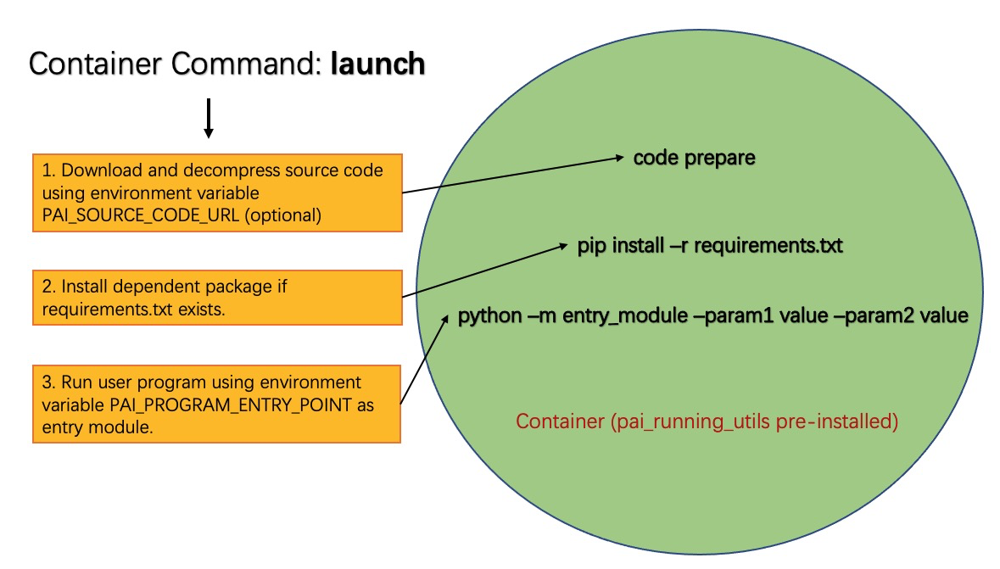

自定义组件
============================

PAI Pipeline Service中可以使用PAI提供的组件处理数据，训练模型，也可以使用用户自定义组件处理具体任务。以下的文档中，介绍了如何创建和使用自定义组件。

PAI Pipeline Service组件运行
----------------------------

PAI Pipeline Service根据推送到服务端的工作流定义，负责完成工作流的运行。
展开的工作流中的每一个节点，对应一个运行容器。对于工作流中的一个节点，Pipeline Service会完成以下工作。

1. 搬运上游节点的输出数据(Artifact），准备挂载到运行容器。
2. 使用组件定义的Command和镜像, 注入节点的运行参数和环境变量等信息，运行容器。
3. 读取容器文件系统，保存节点的输出数据

自定义组件依赖于容器实现，容器和镜像相关的知识请参考 `Docker的文档 <https://docs.docker.com/get-started/>`_

用户的自定义组件是定义对应的容器在Pipeline Service中的运行行为, 他主要包括两部分信息

1. 组件作为节点的输入输出参数/数据的定义，用于引导Pipeline Service完成输入输出数据的搬运, 也作为节点在Pipeline中拼接的 *签名信息* 。

2. 容器镜像运行定义，包含使用的镜像，镜像仓库访问凭证，镜像的环境变量定义，镜像运行命令等信息。Pipeline Service根据这些信息运行对应的镜像。

SDK提供了ContainerOperator和ScriptOperator，方便用户构建自定义组件（**推荐使用ScriptOperator**)。

ContainerOperator
----------------------------

使用SDK中的ContainerOperator，用户可以完成一个基于容器的自定义组件创建，

以下ContainerOperator的一个使用样例，它通过一段Python代码，打印出运行容器的环境变量。
ContainerOperator构造函数的inputs和outputs参数是用于表示组件的输入和输出信息定义， 而image_uri, command, env则分别表示使用的容器，运行命令，和注入容器的环境变量信息。

作为一个组件的定义，构造出来的ContainerOperator可以直接指定输入参数运行，也可以通过 `.save` 方法保存到Pipeline Service后端中，共享给其他用户，或是用于构造新的工作流中一个节点使用。

.. code-block:: python

    import yaml
    from pai.operator.container import ContainerOperator
    from pai.pipeline.types import PipelineParameter

    container_op = ContainerOperator(
        image_uri="python:3",
        inputs=[
            PipelineParameter(name="foo"),
            PipelineParameter(name="bar"),
        ],
        outputs=[],
        command=[
            "python",
            "-c",
            "import os; print('\\n'.join(['%s=%s' % (k, v) for k, v in os.environ.items()]));",
        ],
        env={"CustomEnvKey": "CustomEnvValue"},
    )

    container_op.run(
        job_name="containerTemplExample",
        arguments={
            "foo": "this is foo",
            "bar": "this is bar",
        },
    )
    container_op.save(identifier="containerTemplExample", version="v1")

    print(yaml.dump(container_op.to_dict()))

PAI Pipeline Service使用yaml格式的manifest表示组件或是Pipeline的定义，可以通过 *op.to_dict()* 获取对应的定义信息。

下面的yaml文件manifest来自于以上的ContainerOperator的例子。Manifest中的.spec是组件在Pipeline Service中的运行定义，其中, spec.inputs和spec.outputs是组件在Pipeline Service中的输入输出信息，而container则是对应的容器运行相关的信息。

.. code-block:: yaml

    apiVersion: core/v1
    metadata:
      provider: '1326689413376250'
    spec:
      container:
        command:
        - python3
        - -c
        - import os; print('\n'.join(['%s=%s' % (k, v) for k, v in os.environ.items()]));
        envs:
          CustomEnvKey: CustomEnvValue
        image: python:3
      inputs:
        artifacts: []
        parameters:
        - name: foo
          type: String
        - name: bar
          type: String
      outputs:
        artifacts:
        - metadata:
            type:
              DataSet:
                locationType: OSS
          name: output1
        parameters: []

ScriptOperator
---------------------------

通过SDK的ScriptOperator，用户只需要定义组件的输入输出信息，以及镜像内的执行的Python脚本，既可以完成自定义组件的定义，简化了用户自定义一个组件的成本。

ScriptOperator默认使用Pipeline Service的基础镜像作为组件运行镜像，使用launch命令作为镜像的启动命令。

以下的例子中，我们使用ScriptOperator构建了一个组件，组件对应的容器内会运行我们定义的entry_point，也就是main.py。

.. code-block:: python

    # 调用以下代码前，请先调用setup_default_session初始化与PAI service的session.
    import yaml
    from pai.operator import ScriptOperator
    from pai.pipeline.types import PipelineParameter

    op = ScriptOperator(
        entry_point="main.py",
        script_dir="scripts",
        inputs=[
            PipelineParameter(name="foo", default=10),
            PipelineParameter(name="bar", default=10),
        ],
        outputs=[],
    )

    # 直接运行对应的组件
    # 如果本地安装了docker，可以设置为local_mode=True在本地运行组件对应的容器.
    op.run(
        job_name="exampleScript",
        local_mode=False,
        arguments={
            "foo": "This is FOO",
            "bar": "BAR",
        }
    )

    # 保存组件(组件的identifier-version不能冲突，以下语句只能运行一次).
    op.save(identifier="simpleExample", version="v1")

    # 查看组件的定义信息
    print(yaml.dump(op.to_dict()))

以下是main.py文件中的内容, 在容器内会以 *python -m main --foo 'This is FOO' --bar BAR* 命令被调用。

.. code-block:: python

    import argparse

    def main():
        parser = argparse.ArgumentParser("ScriptOperator arguments parser")
        parser.add_argument("--foo")
        parser.add_argument("--bar")

        args, _ = parser.parse_known_args()

        print("Arguments foo is ", args.foo)
        print("Arguments bar is ", args.bar)

    if __name__ == "__main__":
        main()

ScriptOperator将对应的 `script_dir` 打包上传到OSS中，将对应的OSS URL和运行脚本(entry_point)的作为对应容器的环境变量定义在组件的Manifest中, 默认使用 **launch** 作为镜像的启动命令。

容器内的launch命令是预先安装在默认镜像中(安装pai_running_utils时默认安装的命令行脚本)。他主要完成以下工作:

1. 使用环境变量信息 *PAI_SOURCE_CODE_URL* 拉取并解压缩代码到 */work/code*。
2. 如果对应的代码包中含有 *requirements.txt* 文件，则会使用使用pip完成依赖的安装。
3. 根据环境变量 *PAI_PROGRAM_ENTRY_POINT* 运行对应的代码。

如果需要在ScriptOperator使用自定义镜像，请在镜像中预先安装pai_running_utils.

.. note::

    注： 在ScriptOperator时，无法通过在source_dir的requirements.txt文件完成pai_running_utils的安装。ScriptOperator初始化的launch命令，依赖于pai_running_utils完成代码下载和requirements安装的工作，需要在使用的镜像内预先安装 pai_running_utils

Artifact
------------------------

Artifact是组件的输入输出数据。组件在工作流中运行是，Pipeline Service会在镜像启动前将上游组件输入到当前组件的Artifact搬运到当前组件对应的容器的文件系统中。 默认组件的工作目录定义如下

.. code-block:: shell

    /work/
    |── code                        # 下载的依赖代码所在目录
    |── inputs                      # 输入的相关信息所在的文件夹，包括artifacts和paprameters
    |   |── artifacts
    |   |     └── inputDataSet
    |   |            └── data
    |   └── parameters
    ├── outputs                     # 输出信息所在目录
    |     └── artifacts
    |        └── outputDataSet
    |               └── data

PipelineService默认将输入的数据artifact挂载到 `/work/inputs/artifacts/{artifactName}/data` 路径下，而在组件运行结束后（容器退出后），从 `/work/outputs/artifacts/{artifactName}/data` 路径下读取保存组件的输出数据。

目前的Pipeline Service主要是支持LocationArtifact，对应的Artifact中的数据是实际数据的location信息, 主要包括OssLocationArtifact, MaxcTableLocationArtifact, MaxcOfflinemodelLocationArtifact等。

MaxcTableLocationArtifact包含的数据是MaxComputeTable的表名，project和endpoint等信息。

.. code-block:: python

    {
        "location": {
                "project": "myProject",
                "table": "myTable",
                "partition": "myPartition",
                "endpoint": "myEndpoint",
            }
    }

OssLocationArtifact则是表示在阿里云OSS上存储的数据，包含OSS bucket，endpoint，具体的对象路径等信息。

.. code-block:: python

    {
      "location": {
        "bucket": "pai-test",
        "endpoint": "cn-shanghai.oss.aliyuncs.com",
        "rolearn": "acs:ram::test:role/test-20200902",
        "key": "/paiflow/model_transfer2oss_test/test_health_prediction_by_pipeline_500940.xml"
      },
    }

以下的例子中，使用ScriptOperator定义了一个组件，他的功能是选取输入的MaxCompute表中的部分列，输出一张选择列组成的MaxComputeTable。

组件有3个输入参数，分别为输出目标的MaxCompute表名(destTable)，选择的列信息(selectColNames), 以及执行的MaxCompute引擎配置信息(execution), 输入的MaxCompute表(inputTable)信息以Artifact形式传递。

.. code-block:: python

    from pai.operator import ScriptOperator
    from pai.pipeline.types import PipelineParameter, PipelineArtifact, ArtifactMetadata,
    ArtifactLocationType, ArtifactDataType

    op = ScriptOperator(
        entry_point="main.py",
        script_dir="scripts",
        inputs=[
            PipelineParameter(name="destTable", desc="输出的目的表"),
            PipelineParameter(name="execution", typ=dict, desc="max_compute config"),
            PipelineArtifact(name="selectColNames", metadata=ArtifactMetadata(
                data_type=ArtifactDataType.DataSet, location_type=ArtifactLocationType.MaxComputeTable)),
            PipelineArtifact(name="inputTable", metadata=ArtifactMetadata(
                data_type=ArtifactDataType.DataSet, location_type=ArtifactLocationType.MaxComputeTable)),
        ],
        outputs=[
            PipelineArtifact(name="outputTable", metadata=ArtifactMetadata(
                data_type=ArtifactDataType.DataSet, location_type=ArtifactLocationType.MaxComputeTable)),
        ]
        )

    op.run(
        job_name="example",
        arguments={
            "destTable": "sql_script_dest_table",
            "selectColName": "time,hour,pm2,pm10",
            "execution": {
                "project": "{{test_project_name}}",
                "endpoint": "{{max_compute_project_endpoint}}",
            },
            "inputTable":  "odps://pai_online_project/tables/wumai_data",
        }
    )

以下是使用的Python脚本内容, 他依赖 `pai_running_utils` 的Context获取输入参数和输入数据信息，包括ODPS的运行配置以及输入的表，选择的列等信息，然后调用PyODPS运行构造的SQL, 在任务运行成功之后，写出组件输出的Artifact信息(MaxComputeLocationArtifact).

.. code-block:: python

    import json
    from pai_running.context import Context
    from odps import ODPS

    def main():
        # 获取当前节点的运行相关信息
        context = Context()
        # 节点的运行输入参数(parameters)
        parameters = context.input_parameters
        maxc_config = json.loads(parameters["execution"])

        odps = ODPS(
            access_id=maxc_config["accessKeyId"],
            secret_access_key=maxc_config["accessKeySecret"],
            project=maxc_config["project"],
            endpoint=maxc_config["endpoint"],
        )

        # 节点的输入artifacts
        input_table = context.input_artifacts[0].get_table()
        col_names = parameters["selectColNames"]
        output_table = parameters["outputTableName"]

        sql = "create table {0} select {1} from {2}".format(
            output_table,
            col_names,
            input_table,
        )

        run_instance = odps.run_sql(sql)
        run_instance.wait_for_success()

        context.output_artifacts[0].write_output(
            {
                "table": output_table,
                "project": odps.project,
                "endpoint": odps.endpoint,
            }
        )

    if __name__ == "__main__":
        main()

pai_running_utils介绍
------------------------

*pai_running_utils* 是一个支持容器内，用户自定义镜像如果需要使用，可以在镜像内通过以下命令安装.

.. code-block:: shell

    python -m pip install pai_running_utils

用户脚本可以通过 *pai_running_utils.context.Context* 实例获取对应的运行环境的上下文信息，例如以上的读写Artifact的例子中，容器内的脚本使用context实例获取输入参数信息，以及输入的Artifacts信息。

`pai_running.context.Context` 主要支持运行环境信息包括:

1. 输入的参数信息input_parameters.

.. code-block:: python

    # 可以通过name作为key在input_parameters中查找输入参数的值
    feature_cols = context.input_parameters["featureColNames"]

    for name, value in context.input_parameters.items():
        print("parameters is", name, value)

2. 输入和输出数据(input_artifacts, output_artifacts).

.. code-block:: python

    # 遍历组件输入的artifacts定义，如果有输入信息，则打印artifact的名字和路径.
    for artifact in context.input_artifacts:
         if artifact:
            print(artifact.name, artifact.path)

    # 可以通过名字或是index定位artifact
    context.output_artifacts["outputModel"].write_output(
        {
            "bucket": "test",
            "endpoint": "oss-cn-hangzhou.aliyuncs.com",
            "key": "/pipeline/output/lr_model.xml",
        }
    )

3. 节点在Pipeline Service中运行的运行环境信息。

.. code-block:: python

    # 节点对应的组件的inputs和outputs定义信息
    print(context.inputs_spec)
    print(context.outputs_spec)

    # 节点的运行用户信息
    print(context.user_id)
    # 节点运行的工作空间信息
    print(context.workspace_id)

更加完整的API接口说明，会在后续发布的pai_running_utils的API文档中补充。
