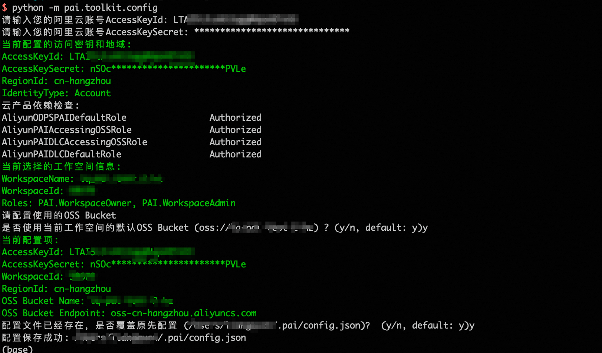

=============
安装和配置
=============

安装
------

请通过以下命令安装PAI Python SDK（请使用Python>=3.8）。

.. parsed-literal::

    python -m pip install pai

前提条件
----------

首次使用PAI Python SDK之前，用户需要完成以下准备工作：

- 获取 *访问凭证AccessKey*

如何创建和获取访问凭证请见文档：`创建AccessKey <https://help.aliyun.com/zh/ram/user-guide/create-an-accesskey-pair>`_ 。

- 开通并加入一个 *PAI工作空间*

当用户通过SDK访问PAI提交作业、部署在线服务、或是注册模型时，需要指定一个PAI工作空间。用户可以通过PAI控制台创建一个PAI工作空间，或是加入一个已有的PAI工作空间。如何创建并加入工作空间，请查看文档：`工作空间管理 <https://help.aliyun.com/zh/pai/user-guide/workspace-management/>`_ 。

- 创建OSS Bucket

用户需要创建一个与工作空间相同地域的OSS Bucket，用于保存代码、模型等资产（可以使用已有的OSS Bucket）。如何创建OSS Bucket请查看文档：`OSS控制台使用 <https://help.aliyun.com/zh/oss/getting-started/console-quick-start>`_ 。

RAM子账号
******************

RAM子账号用户在配置使用SDK之前，请确保有 **PAI工作空间** 和 **OSS Bucket** 的使用权限：

- 子账号用户需要是配置使用的PAI工作空间的 **开发者角色** （或是 **管理员角色** ），才能够在对应的工作空间提交训练作业。工作成员的配置管理请参考文档：`管理成员 <https://help.aliyun.com/zh/pai/user-guide/manage-the-members-of-a-workspace>`_。

- 子账号用户需要有OSS Bucket的读写权限，才能够使用OSS Bucket保存代码、模型等资产。配置RAM用户OSS Bucket权限请参考文档：`操作账号授权：OSS <https://help.aliyun.com/zh/pai/user-guide/grant-the-permissions-that-are-required-to-use-machine-learning-designer#section-u4i-06g-nc4>`_。

初始化配置
----------

通过命令行配置
**************

安装完成后，用户可以通过命令行终端执行 ``python -m pai.toolkit.config`` 命令，按照引导配置SDK访问服务的地域、使用的PAI工作空间、OSS Bucket等信息。

.. code-block::

    # 请在安装完成后，在命令行终端上执行以下命令，按照引导完成配置
    python -m pai.toolkit.config

通过 ``python -m pai.toolkit.config`` 配置示例如下：

当界面出现 **“配置保存成功：<配置保存路径>”** 时，表示配置成功，相应的配置文件默认会保存到 `~/.pai/config.json` 文件中。

通过代码配置
**************

用户可以通过代码方式直接配置使用的工作空间，OSS Bucket等，代码示例如下：

.. code-block:: python

    from pai.session import setup_default_session

    setup_default_session(
        workspace_id="<PAI WorkspaceId>",
        region_id="<RegionId>",
        oss_bucket="<OSS Bucket>",
    )

以上代码中，没有直接配置访问凭证AccessKey，SDK默认将使用凭据链获取访问凭证，凭据链将依次从环境变量，本地配置文件，ECS RAM角色等方式获取访问凭证，具体请参考文档：`Python SDK管理访问凭据 <https://help.aliyun.com/zh/sdk/developer-reference/manage-python-access-credentials#62bf90d04dztq>`_。

（**不推荐**）用户也可以在代码中以明文方式配置访问使用的AccessKey，代码示例如下：

.. code-block:: python

    from pai.session import setup_default_session

    setup_default_session(
        access_key_id="<AccessKeyId>",
        access_key_secret="<AccessKeySecret>",
        workspace_id="<PAI WorkspaceId>",
        region_id="<RegionId>",
        oss_bucket="<OSS Bucket>",
    )
