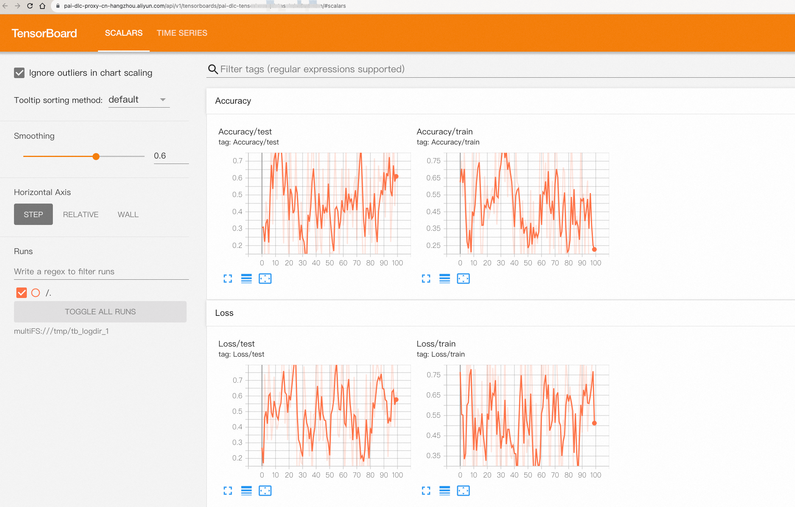

===================
使用TensorBoard
===================

`TensorBoard <https://www.tensorflow.org/tensorboard/get_started>`_ 是一个用于机器学习实验的可视化工具包，他支持用户跟踪和可视化机器学习实验指标，例如记录和查看训练损失/精度、可视化模型图、查看直方图、显示图像等。PAI提供了TensorBoard服务，支持用户PAI上启动TensorBoard应用，查看训练作业写出的TensorBoard日志，实时监控训练过程。

.. note::

    使用 ``TensorBoard`` 的权限要求请参考帮助文档 `创建及管理Tensorboard应用 <https://help.aliyun.com/zh/pai/user-guide/create-and-manage-tensorboard-tasks>`_ 。每一个阿里云账号下最多能够创建5个TensorBoard应用，如果超出限制，创建时会返回 ``TensorboardLimitExceeded`` 错误，用户需要先停止或是删除之前创建的TensorBoard任务。

写出TensorBoard日志
****************************************

训练作业的代码需要将TensorBoard日志写出到环境变量 ``PAI_OUTPUT_TENSORBOARD`` 指定的目录下，
对应的路径下默认会挂载一个OSS Bucket路径，写出的日志信息会被持久化保存到OSS中。

使用PyTorch提供的 ``SummaryWriter`` 写出TensorBoard日志，可以通过以下的方式：

.. code-block:: python
    :caption: train.py

    import torch
    from torch.utils.tensorboard import SummaryWriter
    import os

    # 训练脚本需要将TensorBoard日志写出到环境变量PAI_OUTPUT_TENSORBOARD指定的目录下
    writer = SummaryWriter(log_dir=os.environ.get("PAI_OUTPUT_TENSORBOARD"))

    writer.add_scalar("train/loss", 0.1, 1)
    writer.add_image("train/image", torch.rand(3, 64, 64), 1)
    writer.flush()

使用Huggingface ``transformers`` 的 ``Trainer`` API训练模型，可以通过以下的方式写出TensorBoard日志：

.. code-block:: python
    :caption: train.py

    from transformers import TrainingArguments, Trainer, DataCollatorWithPadding, HfArgumentParser

    log_dir = os.environ.get("PAI_OUTPUT_TENSORBOARD")

    # 配置使用TensorBoard写出metric到指定目录。
    args = TrainingArguments(
        # set log dir for tensorboard
        logging_dir=log_dir,
        report_to="tensorboard",
        # logging strategy
        logging_strategy="steps",
        logging_steps=400,
        # more training arguments..
    )

    trainer = Trainer(
        model=model,
        args=training_args,
        # more args for trainer
    )
    trainer.train()

启动TensorBoard查看日志
*********************************************

在使用 :meth:`~pai.estimator.Estimator` 提交训练作业之后，用户可以通过
:meth:`~pai.estimator.Estimator.tensorboard` 方法在PAI上启动一个TensorBoard应用，
查看训练作业写出的TensorBoard日志。

.. code-block:: python

    # 提交训练作业
    estimator = Estimator(
        command="python train.py",
        source_dir="<SourceDir>",
        image_uri="<TrainingImageUri>",
        instance_type="<TrainingInstanceType>",
    )
    estimator.fit(wait=False)

    # 启动TensorBoard服务，查看训练作业的TensorBoard日志
    tb = estimator.tensorboard()

    # 查看TensorBoard 应用链接
    print(tb.app_uri)

    # 在使用完成之后，删除TensorBoard应用
    tb.delete()

用户也可以直接通过 :meth:`pai.tensorboard.TensorBoard.create` 创建一个TensorBoard应用，
查看OSS Bucket上已有的TensorBoard日志。

.. code-block:: python

    from pai.tensorboard import TensorBoard

    tb = TensorBoard.create(
        uri="oss://<BucketName>/path/to/tensorboard/log/dir/",
    )

    # 查看TensorBoard 应用链接
    print(tb.app_uri)
