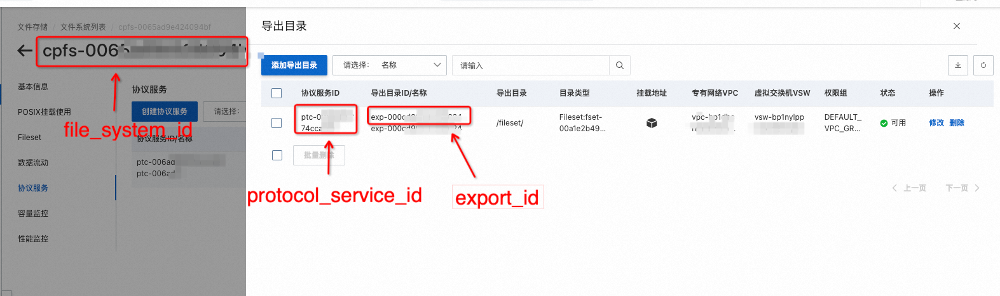

===================
使用训练数据
===================

在模型开发过程中，需要读取数据训练模型，使用测试数据评估模型。PAI支持用户在训练作业中使用多种不同的数据源完成模型开发，
包括OSS、NAS、MaxCompute等。

本文档介绍了如何在PAI训练作业中使用这些数据源完成模型开发。

读写OSS的数据
****************

PAI训练作业支持通过挂载的方式使用OSS，用户的训练代码可以通过标准的POSIX API，以读写本地文件的方式读写OSS上的数据。

使用 :meth:`~pai.estimator.Estimator.fit` 方法的 ``inputs`` 参数，我们可以指定输入的名称以及
OSS URI格式的输入数据路径，相应的OSS路径将在用户训练程序启动前挂载到训练作业实例中，用户的训练代码可以通过
``/ml/input/data/{input_name}`` 目录，读取到OSS/NAS挂载的数据。

在训练作业中挂载使用OSS的示例代码如下:

.. code-block:: python

    from pai.estimator import Estimator

    est = Estimator(
        command="python train.py",
        source_dir="<DirectoryToTrainingCode>"
        image_uri="<TrainingImageURI>",
        instance_type="ecs.c6.xlarge",
    )

    # 提交训练作业
    est.fit(
        # inputs参数表示训练作业的输入训练数据
        inputs={
            "train": "oss://<YourBucketName>/path/to/train/data/",
            "test": "oss://<YourBucketName>/path/to/test/data/"
        }
    )

以上的示例中，训练作业使用两个OSS上的输入数据，``train`` 和 ``test``，分别对应了OSS上的两个数据路径，
可以通过读取 ``/ml/input/data/train`` 目录和 ``/ml/input/data/test`` 目录获取挂载数据。

训练代码通过读写文件方式读写OSS上的数据:

.. code-block:: python

    # 模型训练代码
    import os

    # 通过环境变量 PAI_INPUT_{NAME_UPPER_CASE} 获取输入数据的文件路径
    # train_data_path = os.environ.get("PAI_INPUT_TRAIN")
    # test_data_path = os.environ.get("PAI_INPUT_TEST")

    train_data_path = "/ml/input/data/train/"
    train_data_path = "/ml/input/data/test/"

    # 读取数据
    with open(os.path.join(train_data_path, "data.csv"), "r") as f:
        print(f.readlines())

使用NAS存储
***********************

阿里云NAS提供了多种类型的文件存储，包括通用型NAS、极速型NAS、CPFS等，满足用户在不同场景下对于文件存储的需求。
对于NAS的具体介绍可以见文档: `文件存储NAS <https://help.aliyun.com/zh/nas/>`_。

PAI支持通过挂载的方式使用NAS，训练代码可以通过读写本地文件的方式读写NAS上的数据。

.. note::

    极速型NAS和CPFS文件存储需要通过用户VPC网络内的挂载点挂载访问。在使用以上类型NAS存储时，训练作业 **必须** 使用 :class:`~pai.estimator.UserVpcConfig` 配置与用户VPC网络连通，训练作业实例才能访问与用户VPC互通，使用用户VPC内的挂载点挂载NAS存储。

使用通用型NAS和极速型NAS
--------------------------

对于通用型NAS和极速型NAS，可以通过 :class:`~pai.estimator.FileSystemInput` 指定使用的NAS的ID
(``file_system_id``）和需要挂载访问的数据路径，将NAS挂载到训练作业中， 示例代码如下:

.. code-block:: python

    from pai.estimator import Estimator, FileSystemInput, UserVpcConfig

    est = Estimator(
        image_uri="<TrainingImageUri>",
        command="sh train.sh",
        instance_type="ecs.c6.xlarge",
        # 配置训练作业实例与用户VPC连通
        user_vpc_config=UserVpcConfig(
            vpc_id="<VpcId>",
            security_group_id="<SecurityGroupId>",
        )
    )

    est.fit({
        "train_data": FileSystemInput(
            # 用户创建的NAS文件系统的ID
            file_system_id="<FileSystemId>",
            # NAS文件系统内的数据路径，将被挂载到训练作业中
            directory_path="/path/to/train/data/"),
    })

以上的代码，将用户的NAS文件系统中的 ``/path/to/train/data/`` 目录挂载到训练作业中，用户可以通过读取
``/ml/input/data/train_data/`` 路径获取NAS上的数据。

使用文件存储CPFS
--------------------------

文件存储CPFS可以通过NFS或是PosixClient的方式挂载使用，PAI的训练作业目前支持NFS的方式挂载使用CPFS。
在挂载使用之前，用户需要先创建 ``CPFS协议服务`` 和 ``导出目录``，具体操作流程可以见文档: `CPFS NFS使用文档 <https://help.aliyun.com/document_detail/427172.html>`_ )。

获取 ``CPFS协议服务ID`` (protocol_service_id) 和 ``导出目录ID`` (export_id)后，可以通过
:class:`~pai.estimator.CpfsFileSystemInput` 将CPFS挂载到训练作业中，示例代码如下：

.. code-block:: python

    from pai.estimator import Estimator, CpfsFileSystemInput

    est = Estimator(
        image_uri="<TrainingImageUri>",
        command="sh train.sh",
        instance_type="ecs.c6.xlarge",
        # 配置训练作业实例与用户VPC连通
        user_vpc_config=UserVpcConfig(
            # 用户VPC的ID
            vpc_id="<VpcId>",
            # 用户安全组ID
            security_group_id="<SecurityGroupId>",

        )
    )

    est.fit(
        inputs={
            # 将CPFS挂载到训练作业的 /ml/input/data/train/ 目录。
            "train": CpfsFileSystemInput(
                file_system_id="<FileSystemId>",
                protocol_service_id="<ProtocolServiceId>",
                export_id="<ExportId>",
        )},
    )

使用MaxComputeTable作为训练数据
********************************

MaxCompute是阿里云提供的云原生大数据计算服务，支持PB级数据的存储和计算。PAI支持用户在训练作业中，使用MaxCompute上的数据表作为训练数据训练模型。

以下示例提交的训练作业，将使用 ``<ExampleProjectName>`` 项目下的 ``<ExampleTableName>`` 表作为训练数据。

.. code-block:: python

    from pai.estimator import Estimator, FileSystemInput

    est = Estimator(
        image_uri="<TrainingImageUri>",
        command="sh train.sh",
        instance_type="ecs.c6.xlarge",
    )

    est.fit(
        {
            # 通过ODPS URI指定一个MaxCompute表作为训练数据
            "train": "odps://<ExampleProjectName>/tables/<ExampleTableName>"
        }
    )

对于MaxComputeTable类型的输入，PAI训练作业会将表的元信息和访问凭证准备到训练作业环境中。

- 使用MaxCompute表输入时, 默认的输入路径 ``/ml/input/data/{input_name}`` 路径下，将包含输入表的元信息。
  通过读取目录下的 ``meta.json``，训练代码可以获取到输入表名，所在的Project，以及访问的Endpoint。

- 训练服务会准备相应的访问凭证（AccessKey），支持训练代码访问MaxCompute表。

以下代码示例展示了通过 ``PyODPS`` 在训练代码中读取MaxCompute表的数据。

.. code-block:: python

    import os
    import json
    from odps import ODPS
    from odps.accounts import StsAccount

    def get_input_table_meta(channel_name: str):
        """获取输入表元信息"""

        meta_path = os.path.join("/ml/input/data/{}".format(channel_name), "meta.json")
        with open(meta_path, "r") as f:
            metadata = json.load(f)

        endpoint = metadata.get("endpoint")
        odps_table_uri = metadata.get("path")
        project_name, _, table_name = odps_table_uri[7:].split("/")
        return endpoint, project_name, table_name

    def get_credential():
        """获取MaxCompute访问凭证"""
        # odps_credential_path = os.environ.get("PAI_ODPS_CREDENTIAL")
        odps_credential_path = "/ml/input/credential/odps.json"
        with open(odps_credential_path, "r") as f:
            data = json.load(f)
        return data["AccessKeyId"], data["AccessKeySecret"], data["SecurityToken"]

    def read_table():
        """读取输入表数据"""
        access_key_id, access_key_secret, security_token = get_credential()
        endpoint, project_name, table_name = get_input_table_meta("train")

        account = StsAccount(
            access_id=access_key_id,
            secret_access_key=access_key_secret,
            sts_token=security_token,
        )
        o = ODPS(account=account, project=project_name, endpoint=endpoint)

        # 读取输入表数据
        for record in o.read_table(table_name):
            print(record)

    if __name__ == "__main__":
        read_table()
